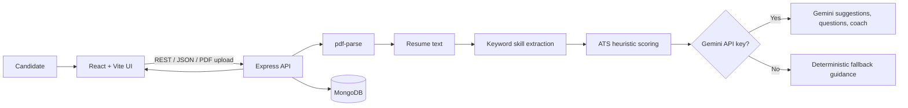
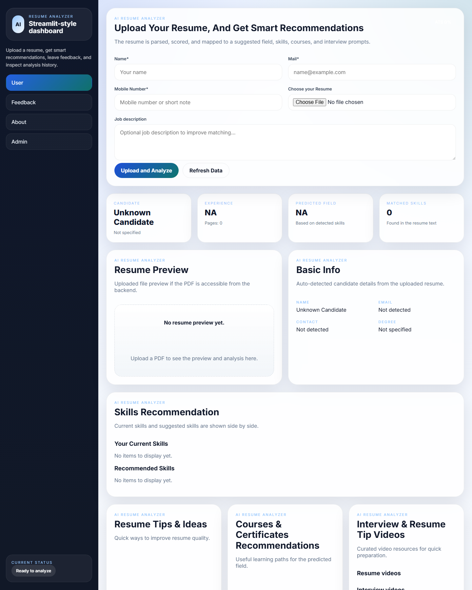

# AI Resume Analyzer

An interview-ready full-stack application that compares a PDF resume with a job description, highlights skill gaps, calculates an explainable ATS-style score, and provides resume and interview guidance.

> **Primary implementation:** React + Node.js + Express + MongoDB. The `App/` directory is an earlier Streamlit prototype retained to show the project's evolution.

## Problem Statement

Job seekers often receive no actionable feedback after applying. They may not know whether their resume includes the skills a role expects, what an ATS might flag, or how to prepare for an interview. This project turns a resume and job description into clear, explainable feedback: matched skills, missing skills, an ATS-style score, improvement suggestions, and interview questions.

## Features

- Upload and parse PDF resumes
- Compare detected resume skills with a pasted job description
- Show matched skills, missing skills, and job-required skills
- Calculate an explainable ATS-style score
- Extract basic candidate details such as email, phone, degree, and experience level
- Generate resume suggestions and interview questions
- Provide an optional Gemini-powered interview coach
- Store resumes, analyses, and feedback in MongoDB
- Display analysis history and export it as CSV

## Tech Stack

| Layer | Technologies |
| --- | --- |
| Frontend | React, Vite, Axios, Chart.js |
| Backend | Node.js, Express, Multer |
| Database | MongoDB, Mongoose |
| Authentication | JWT, bcryptjs |
| Resume parsing | `pdf-parse` |
| Optional generative AI | Google Gemini 1.5 Flash API |
| Prototype | Python, Streamlit (in `App/`) |

## System Architecture



## How It Works

1. The candidate uploads a PDF resume and optionally pastes a job description.
2. The backend stores the file metadata and extracts PDF text using `pdf-parse`.
3. A curated skill library scans both the resume text and job description for explicit keywords.
4. The ATS service compares both sets of skills and returns matched and missing skills.
5. The service calculates a score from job-skill coverage, resume length, and common resume sections.
6. The backend saves the analysis in MongoDB and returns it to the React dashboard.
7. If `GEMINI_API_KEY` is configured, Gemini creates personalized suggestions, interview questions, and coach responses. Otherwise, deterministic fallback text is used.

## AI / Resume Analysis Process

```text
Resume PDF
    ↓
Text extraction (pdf-parse)
    ↓
Resume processing
    ↓
Skill / keyword extraction (curated skill library)
    ↓
Job-description analysis (same keyword extraction)
    ↓
Matching and ATS-style scoring
    ↓
Missing skills and recommendations
    ↓
Optional Gemini-generated suggestions / interview coaching
    ↓
React dashboard
```

### Where AI is actually used

The core resume scoring is **not a trained machine-learning model**. It is deterministic and explainable:

- `skillExtractor.js` uses case-insensitive keyword matching against a curated skill library.
- `atsService.js` scores job-skill coverage (up to 70 points), resume length (up to 20), and presence of `experience`, `education`, and `skills` sections (up to 9).
- `resumeProfile.js` uses rules and regular expressions for contact details, degree, field, and experience-level extraction.

Gemini is an **optional LLM integration** in `geminiService.js`. When an API key exists, it produces personalized improvement suggestions, interview questions, and coach-chat answers. When no key is configured, the app returns predefined fallback guidance.

**Interview-safe explanation:** “The matching and score are rule-based so they stay transparent and predictable. I use Gemini only for optional natural-language guidance; I do not describe the ATS score as a machine-learning prediction.”

## Why React/Node and Streamlit Are Both Present

The Streamlit version in `App/` was the **earlier prototype** used to validate the resume-analysis workflow quickly. The React + Node + MongoDB implementation is the **primary portfolio project**. It demonstrates a separated client and API, REST endpoints, authentication, persistence, file uploads, and a scalable project structure. For interviews, present the React/Node version first and describe Streamlit as the prototype that informed it.

## Database

MongoDB is accessed through Mongoose. The core collections are:

| Collection | Purpose |
| --- | --- |
| `users` | Registered user profile and hashed password |
| `resumes` | Uploaded-file metadata and extracted text |
| `analyses` | Score, skills, suggestions, profile details, and questions |
| `feedback` | User ratings and comments |

The uploaded PDF itself is stored locally during development in `backend/uploads/`; production deployments should use object storage such as S3 or Google Cloud Storage.

## API Endpoints

Base URL: `http://localhost:5000/api` by default (or the port configured in `backend/.env`).

| Method | Endpoint | Description |
| --- | --- | --- |
| POST | `/auth/register` | Create an account |
| POST | `/auth/login` | Authenticate and receive a JWT |
| POST | `/resume/upload` | Upload a PDF resume |
| POST | `/resume/analyze` | Analyze the uploaded resume against a job description |
| GET | `/resume/latest` | Get the latest analysis |
| GET | `/resume/history` | Get saved analysis history |
| POST | `/interview/questions` | Generate interview questions |
| POST | `/interview/chat` | Send a question to the interview coach |
| POST | `/feedback/submit` | Submit application feedback |

Protected routes accept `Authorization: Bearer <JWT_TOKEN>`. See [docs/API.md](docs/API.md) for endpoint details.

## Screenshots

The current React upload dashboard is captured below. For a complete analysis-result capture, start MongoDB, upload a non-sensitive sample PDF, analyze it against a sample job description, and add the resulting screen to this directory.



## Installation

### Prerequisites

- Node.js 18 or newer
- MongoDB locally or a MongoDB Atlas connection string
- Optional: a Gemini API key for generative suggestions and interview coaching

### Setup

```bash
git clone https://github.com/PrinceRawat423/AI_RESUME_ANALYZER_PROJECT.git
cd AI_RESUME_ANALYZER_PROJECT
npm install
```

Copy the example environment files:

```bash
Copy-Item backend/.env.example backend/.env
Copy-Item frontend/.env.example frontend/.env
```

Start both apps in development mode:

```bash
npm run dev
```

The frontend is served by Vite (normally `http://localhost:5173`). The backend uses the `PORT` from `backend/.env`.

## Environment Variables

`backend/.env`

```env
MONGODB_URI=mongodb://localhost:27017/resume_analyzer
JWT_SECRET=replace-with-a-long-random-secret
GEMINI_API_KEY=optional-gemini-api-key
PORT=5000
NODE_ENV=development
```

`frontend/.env`

```env
VITE_API_BASE_URL=http://localhost:5000/api
```

Never commit the real `.env` files. The repository includes `.env.example` files instead.

## Project Structure

```text
frontend/                 React user interface
backend/                  Express API, MongoDB models, analysis services
  services/               Skill extraction, ATS scoring, Gemini integration
  controllers/            Upload, analysis, auth, feedback handlers
  routes/                 REST API routes
App/                      Earlier Streamlit prototype
docs/                     API documentation and screenshots
```

## Future Improvements

- Add OCR for scanned/image-only PDFs
- Use embeddings for semantic skill matching while retaining explainable score components
- Add automated unit, API, and end-to-end tests
- Move uploads to cloud object storage
- Add rate limiting, input validation, and monitoring
- Add CI/CD and deploy the frontend, backend, and MongoDB Atlas configuration
- Add recruiter-facing comparison and reporting features

## License

MIT
